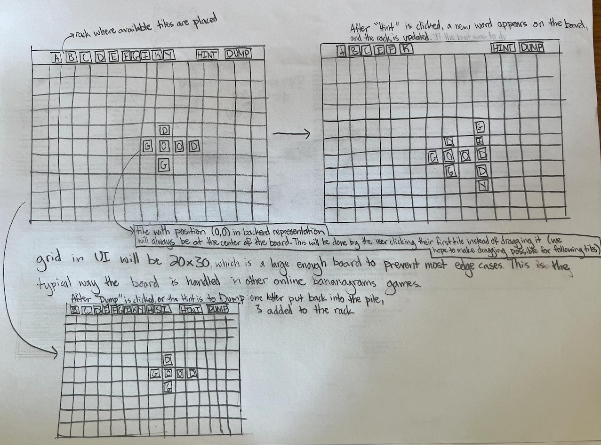

1. This project implements a functional Bananagrams solver in OCaml. It models the core components of the game — tiles, words, and the board — using immutable data structures. The system can validate board states, ensuring all tiles form connected, dictionary-valid words, and can automatically play moves by generating and placing valid words from a given rack of tiles.

2. One portion of our project is the bananagrams solver algorithm. It works by utilizing a set of heuristics to determine how to add the remaining tiles to the board. It determines different possibilities by checking unobstructed areas to add a word to (or extend a word), and using a map of anagrams to get possibilities. It chooses the best candidate by seeing which letters it uses (e.g. a Q is harder to get rid of, so if one candidate move gets rid of it, that is probably better). This algorithm is solely based on the board, some utility variables like the anagram list, and the player's pool of tiles to use (their "rack"). It returns the next move. This lends itself to a functional algorithm.

3. We plan to use Dream and Core. Also, although not a library, we’ll be using ReScript for frontend work. 

5. Basic Banagrams library, supporting key game actions such as placing tiles, grabbing new tiles, and validating the state of the board. Done by 11/23.
A graphical user interface for players to interact with the banagrams game that connects to the banagrams server hosting the game (localhost). Done by 11/29.
A banagrams solver which will suggest a move given the board and the player's rack. Done by 12/1.
Testing code will be written along the way (aiming for 60% on 12/5)
The rest of the testing code will be written by the final demo day. 

